<div align="center">

# discord-voice-tray

***Linux tray icon that mirrors your Discord voice status in real time — in channel, muted, or deafened.***



</div>

The Discord client for Linux shows a static tray icon: to know whether you are muted you have to open the window. This daemon watches Discord's local RPC socket and publishes a dynamic icon via StatusNotifierItem, just like the Windows client does out of the box. Zero configuration: start it, authorize once in Discord, and it works.

## How it works

A single process with two tasks: one connects to Discord's IPC socket, authenticates via OAuth (StreamKit, no app registration needed) and subscribes to voice events; the other reflects every change on the panel icon. The authorization popup appears only the first time — the token is cached in `~/.config/discord-voice-tray/`. If Discord closes, the icon hides and the daemon reconnects on its own when Discord comes back. Protocol and auth details in the [development guide](docs/development.md).

## States

| State           | Icon              | Meaning                          |
|-----------------|-------------------|----------------------------------|
| `Idle`          | light headset     | Connected, not in a voice channel |
| `VoiceUnmuted`  | green             | In channel, mic open             |
| `VoiceMuted`    | red crossed mic   | In channel, muted                |
| `VoiceDeafened` | crossed headphones | In channel, deafened            |

Deafened wins over muted; mute/deafen only matter inside a channel. When Discord is not running, the icon hides automatically (SNI `Passive`) and reappears as soon as Discord comes back.

## Quick install

```bash
cargo install --path .
```

- Installs a single self-contained binary at `~/.cargo/bin/discord-voice-tray` — icons embedded, no extra files, no icon themes.
- Requires the official Discord client (the browser version does not create the RPC socket).
- Requires a panel with StatusNotifierItem support: XFCE 4.16+, KDE Plasma, or GNOME with the AppIndicator extension.
- To try it without installing: `cargo run --release`.

## Quick start

1. With Discord open, run `discord-voice-tray &`.
2. Accept the authorization popup in Discord (first time only — the token is cached afterwards).
3. Done: the icon now mirrors your voice status.

**Stopping and restarting.** Right-click the icon → *Quit* stops the daemon; it does not start again by itself. To bring it back, just run `discord-voice-tray &` again. To make it survive logouts and start with your session, install the systemd user unit instead of launching it by hand:

```bash
cp systemd/discord-voice-tray.service ~/.config/systemd/user/
systemctl --user daemon-reload
systemctl --user enable --now discord-voice-tray
```

From then on manage it with `systemctl --user stop|start|restart discord-voice-tray` and read its logs with `journalctl --user -u discord-voice-tray -f`. Verbose logs when running by hand: `RUST_LOG=debug discord-voice-tray`. Common issues in [troubleshooting](docs/troubleshooting.md).

## Architecture

| Module          | Role                                                       |
|-----------------|------------------------------------------------------------|
| `src/ipc/`      | Socket, framing, RPC session (handshake/auth/subscribe) and reconnection with backoff |
| `src/state.rs`  | Pure `VoiceState` state machine, testable without a socket |
| `src/tray.rs`   | StatusNotifierItem (ksni): icon, tooltip and menu          |
| `src/config.rs` | Optional TOML config and OAuth token cache                 |
| `src/main.rs`   | Startup, `watch` channel between tasks and clean shutdown  |

Full code map, design rules and recipes for extending it (icons, events, states) in the [development guide](docs/development.md).

## License

[MIT](LICENSE) — use it, modify it and redistribute it freely.
